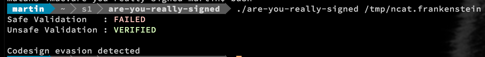
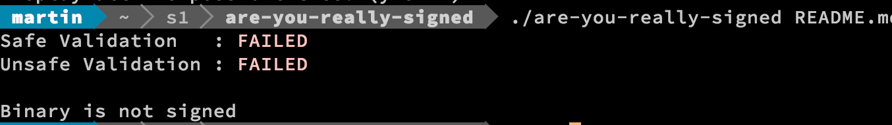
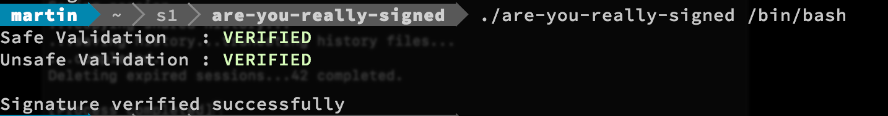

Are you really signed?
========================

[We](https://sentinelone.com) are providing this tool to allow for easy testing of the recently discovered code-sign bypass vulnerability discovered by Okta.
More information about the vulnerability itself can be found in the disclosure ["I can be Apple, and so can you"](https://www.okta.com/security-blog/2018/06/issues-around-third-party-apple-code-signing-checks/)

You can download the tool from this repository or compile it yourself, we are distributing it under the [MIT License](LICENSE.TXT).


Usage
------


```
are-you-really-signed [-h] [-a] <Signed File>
Flags:
        -a: Check with 'anchor trusted' instead of 'anchor apple generic' - Pin to Cert Store instead of Apple Certs (for corporate purposes mostly).
        -h: Print help and usage

Return Codes
0 - Signed with valid chain validation (anchor apple)
1 - Signing evasion detected
2 - File not signed
3 - File not found/Usage
```


Example Usage
--------------

Signature Evasion Detection


File that isn't signed


File that has valid signing and is pinned with the root trust (Apple by default, entire Trust store by flag -a)


