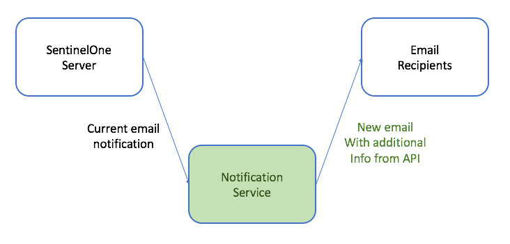
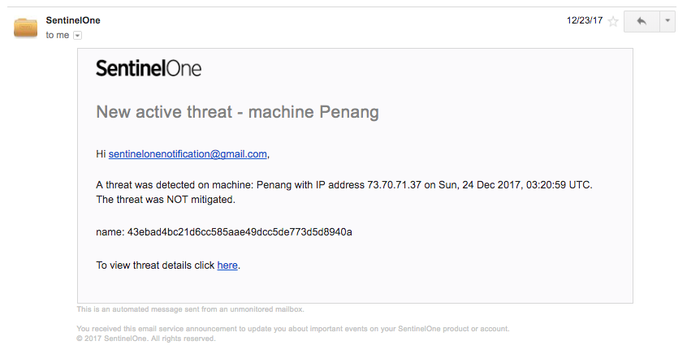
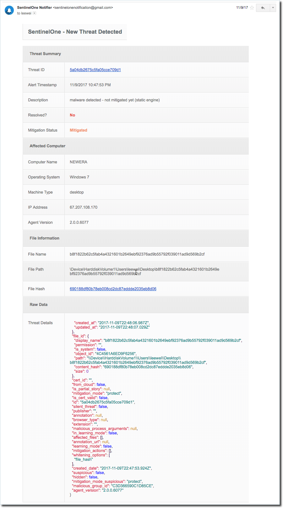

# s1-notification-service

The existing SentinelOne email notification service:

Using the S1 Notificaion Service, the email is intercepted (redirected), then resent with additional information and custom formatting.

Example email currently available:

Example email being sent:

