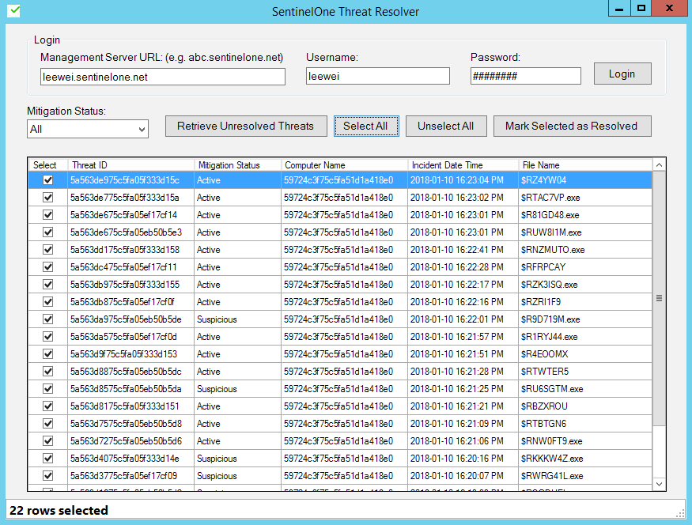

# s1-threat-resolver

Within the Console user interface, SentinelOne admin resolves threat one item at a time.

There are situations where bulk resolve is useful, such as in the case when performing malware testing.

The SentinelOne Threat Resolver provides a GUI for easier bulk resolve.

